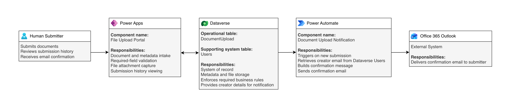

# File Upload Portal

A Microsoft Power Platform solution for structured document and metadata intake using Power Apps, Microsoft Dataverse, Power Automate, and Office 365 Outlook.

## Architecture

The solution uses a Power Apps Canvas App for document submission and history viewing, Microsoft Dataverse as the system of record, and a Dataverse-triggered Power Automate flow for confirmation emails.

See [Architecture](docs/architecture.md) for implementation details.

## Solution

- Users submit document metadata and file attachments through the **File Upload Portal** Canvas App.
- The **DocumentUpload** Dataverse table stores submission metadata and file content.
- Power Apps reads from and writes to Dataverse.
- The **Document Upload Notification** cloud flow runs after a new submission is created.
- The flow retrieves the creator's email from the Dataverse **Users** system table.
- **Office 365 Outlook** delivers the confirmation email.

## Technologies

- Power Apps (Canvas App)
- Microsoft Dataverse
- Power Automate (Cloud Flow)
- Office 365 Outlook
